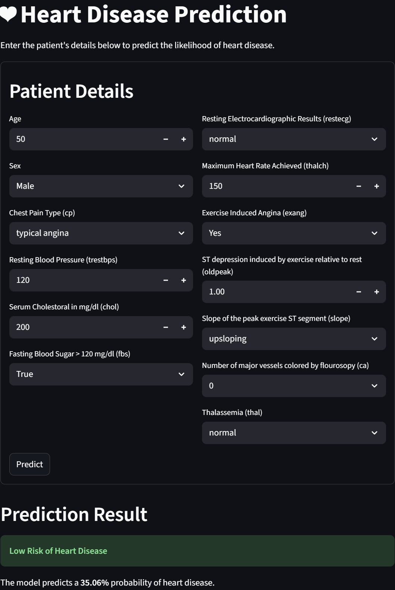

# ❤️ Heart Disease Prediction System

A machine learning-based web application that predicts the likelihood of heart disease based on patient medical data.



## 🌟 Model Performance

- 🏆 Overall Best Model: RandomForestClassifier with accuracy 0.8207
- Final accuracy on test set: 0.8696

## 🎯 Features

- Interactive web interface built with Streamlit
- Real-time predictions using machine learning
- Comprehensive input validation
- Multiple machine learning models compared (Random Forest, XGBoost, SVM, Logistic Regression)
- Automated hyperparameter tuning
- Professional medical data visualization

## 📊 Input Parameters

The system accepts the following patient parameters:

1. Age
2. Sex
3. Chest Pain Type (cp)
4. Resting Blood Pressure (trestbps)
5. Serum Cholesterol (chol)
6. Fasting Blood Sugar (fbs)
7. Resting ECG Results (restecg)
8. Maximum Heart Rate (thalch)
9. Exercise Induced Angina (exang)
10. ST Depression (oldpeak)
11. ST Segment Slope (slope)
12. Number of Major Vessels (ca)
13. Thalassemia (thal)

## 🚀 Getting Started

### Prerequisites

- Python 3.8+
- pip package manager

### Installation

1. Clone the repository:
```bash
git clone https://github.com/raunakwete43/DSHS-Mini-Projecr DSHS
cd DSHS
```

2. Install required packages:
```bash
pip install -r requirements.txt
```

### Running the Application

1. Start the Streamlit app:
```bash
streamlit run src/app.py
```

2. Open your browser and navigate to `http://localhost:8501`

## 🔧 Model Training

To retrain the model with new data:

```bash
python src/train.py
```

This will:
1. Load and preprocess the data
2. Perform hyperparameter tuning on multiple models
3. Save the best performing model and artifacts

## 📝 Project Structure

```
DSHS/
├── src/
│   ├── app.py          # Streamlit web application
│   ├── train.py        # Model training script
│   └── model_artifacts.joblib  # Saved model and preprocessing artifacts
├── assets/
│   └── image.png       # Demo screenshot
├── README.md
└── requirements.txt
```

## ⚠️ Disclaimer

This tool is for educational purposes only and should not be used as a substitute for professional medical advice, diagnosis, or treatment.

## 📄 License

This project is licensed under the MIT License - see the LICENSE file for details.
